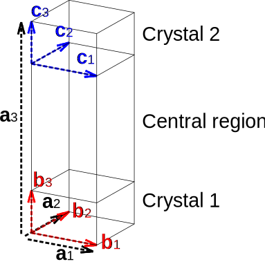
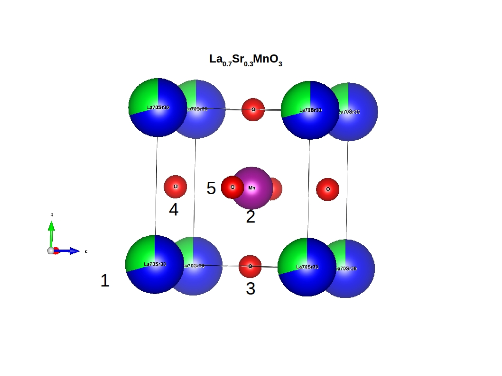

System
======

General overview
----------------

Data defining the system, like crystallographic data, is stored in
groups within **system**. If more than one system are to be stored in
the same **system** group, then each should go to its own subgroup. The
choice of name for the subgroup is left to the user, with the
restriction that it cannot be any of the names already in use in these
specifications. If only one system is to be specified, then it can be
stored directly in the **system** group or in its own subgroup.

The group must have the following attributes:

-  **system\_name**
-  **number\_of\_physical\_dimensions**
-  **dimension\_types**
-  **lattice\_vectors**
-  **embedded\_system**
-  **number\_of\_species**
-  **number\_of\_sites**

The group may have the following optional attributes:

-  **number\_of\_symmetry\_operations**
-  **symmorphic**
-  **time\_reversal\_symmetry**
-  **spacegroup\_3D\_number**
-  **bulk\_regions\_for\_semi\_infinite\_dimension**

The group must contain the following datasets:

-  **species\_at\_sites**

The group must contain at least one of the following datasets:

-  **cartesian\_site\_positions**
-  **fractional\_site\_positions**

The group must contain at least one of the following datasets:

-  **species\_names**
-  **chemical\_symbols**
-  **atomic\_numbers**

The group may contain the following optional datasets:

-  **reduced\_symmetry\_matrices**
-  **reduced\_symmetry\_translations**
-  **number\_of\_species\_at\_site**
-  **concentration\_of\_species\_at\_site**
-  **local\_rotations**
-  **magnetic\_moments**
-  **site\_regions**
-  **cell\_in\_host**
-  **site\_in\_host**
-  **forces**
-  **stress\_tensor**

Detailed description of variables
---------------------------------

General variables
~~~~~~~~~~~~~~~~~

These variables convey the most basic information regarding the geometry
of the system. They are all mandatory.

-  **system\_name**: attribute, char(80)
   Specifies the name of the system. This information is stored for
   debugging or visualization purposes.

-  **number\_of\_physical\_dimensions**: attribute, unsigned int (always
   ``3``)
   The number of physical dimensions in space. Note that this is not the
   same as the number of periodic directions, which might be less than
   or equal to this number.

-  **dimension\_types**: attribute, int
   [**number\_of\_physical\_dimensions**] (between ``0`` and ``2``)
   This is a list defining the periodicity of the system in each of the
   directions given by the **lattice\_vectors**. Valid options are:

   -  ``0``: The direction is non-periodic.
   -  ``1``: The direction is periodic.
   -  ``2``: The direction is semi-infinite. Only one direction can take
      this value; if it is present, then additional variables are
      required (see variables relating to a semi-infinite setup).

-  **embedded\_system**: attribute, char(3) (``yes`` or ``no``)
   Is the system embedded into a host geometry? If ``yes``, then
   additional variables are required, and the host geometry should be
   described in a separate group (see variables relating to an embedded
   system).

Variables relating to the cell
~~~~~~~~~~~~~~~~~~~~~~~~~~~~~~

These variables define and describe properties of the unit cell. Only
the first is mandatory. Note that the number of lattice vectors must be
equal to the number of physical dimensions, even if some of these are
non-periodic (see **dimension\_types**). In this case, lattice vectors
in non-periodic directions are not used, other than for defining
**fractional\_site\_positions**; we suggest to set them either to an
orthonormalized set or to a large box containing the molecule. The
latter would be particularly useful for a periodic code reading in the
geometry.

-  **lattice\_vectors**: attribute, double
   [**number\_of\_physical\_dimensions**]
   [**number\_of\_physical\_dimensions**] (dimensional variable: length)
   Holds the real-space lattice vectors (in Cartesian coordinates) of
   the simulation cell. The last (fastest) index runs over the x,y,z
   Cartesian coordinates, and the first index runs over the 3 lattice
   vectors.

-  **bulk\_regions\_for\_semi\_infinite\_dimension**: see variables
   relating to a semi-infinite setup
-  **stress\_tensor**: see variables relating to relaxation and MD

Variables relating to species
~~~~~~~~~~~~~~~~~~~~~~~~~~~~~

These variables define the available species (i.e., possible types of
inequivalent sites). The species can be described in three different
ways, at least one of which must be included; however, more than one
might be necessary to provide a complete description.

-  **number\_of\_species**: attribute, unsigned int
   The number of different species in the system.

-  **species\_names**: dataset, char(80) [**number\_of\_species**]
   Descriptive name for each species. Could simply be equal to
   **chemical\_symbols** or contain extra information (e.g.,
   ``Ga-semicore``, ``C-1s-corehole``, ``C-sp2``, ``C1``, etc.)

-  **chemical\_symbols**: dataset, char(3) [**number\_of\_species**]
   The chemical symbol for each species. ``X`` may be used for a
   non-traditional atom (see **atomic\_numbers**).

-  **atomic\_numbers**: dataset, double [**number\_of\_species**]
   (dimensional variable: charge)
   The atomic number for each species. This could be non-integer for a
   number of reasons (e.g., a VCA atom), or zero (e.g., an empty site).
   In such cases we recommend using **species\_names** to clarify the
   nature of the site.

Variables relating to sites
~~~~~~~~~~~~~~~~~~~~~~~~~~~

These variables define the position and attributes of each site in the
unit cell. Only the first four are mandatory. Note that it is possible
to define sites which are a statistical mixture of more than one
species; the number of component species can be specified individually
for each site. Some of the properties of the site relate to the site as
a whole (i.e., its position), while others need to be specified for each
component species (i.e., the magnetic moment).

-  **number\_of\_sites**: attribute, unsigned int
   The number of sites in the unit cell.

-  **cartesian\_site\_positions**: dataset, double
   [**number\_of\_sites**] [**number\_of\_physical\_dimensions**]
   (dimensional variable: length)
   The position of each site in cartesian (absolute) coordinates.

-  **fractional\_site\_positions**: dataset, double
   [**number\_of\_sites**] [**number\_of\_physical\_dimensions**]
   The position of each site in fractional (reduced/crystallographic)
   coordinates.

-  **species\_at\_sites**: dataset, unsigned int [**number\_of\_sites**]
   [**number\_of\_species\_at\_site**\ (**site\_index**)]
   This variable defines the species at each site, according to the list
   specified previously (see variables relating to species). If
   [**number\_of\_species\_at\_site**\ (**site\_index**)] is set to
   ``1``, the site is simply a single species; otherwise, it will be a
   mixture of more species.

-  **number\_of\_species\_at\_site**: dataset, unsigned int
   [**number\_of\_sites**]
   The number of component species for each site. If not present, it is
   taken to be ``1`` for all sites (i.e., no statistical mixing).

-  **concentration\_of\_species\_at\_site**: dataset, double
   [**number\_of\_sites**]
   [**number\_of\_species\_at\_site**\ (**site\_index**)]
   The statistical concentration of each component species at each site.
   This variable needs to be present if
   **number\_of\_species\_at\_site** is present; otherwise, it is not
   used.

-  **local\_rotations**: dataset, double [**number\_of\_sites**]
   [**number\_of\_physical\_dimensions**]
   [**number\_of\_physical\_dimensions**]
   A rotation matrix defining the orientation of each site. If the
   rotation matrix only needs to be specified for some sites, the
   remaining sites should set it to the zero matrix (not the identity!)

-  **magnetic\_moments**: dataset, double [**number\_of\_sites**]
   [**number\_of\_species\_at\_site**\ (**site\_index**)]
   [**number\_of\_physical\_dimensions**] (dimensional variable:
   magnetic moment)
   The magnetic moment of each component at each site. If the magnitude
   is not important, we recommend to normalize the vector. Please
   remember that the Bohr magneton has a value of :math:`1/2` in atomic
   units!

-  **site\_regions**: see variables relating to a semi-infinite setup
-  **cell\_in\_host**: see variables relating to an embedded system
-  **site\_in\_host**: see variables relating to an embedded system
-  **forces**: see variables relating to relaxation and MD

Variables relating to spatial symmetry
~~~~~~~~~~~~~~~~~~~~~~~~~~~~~~~~~~~~~~

The symmetry variables are optional. If the symmetry of the system is
unknown, they should all be excluded. If the symmetry is to be
specified, at least the first three need to be included.

-  **number\_of\_symmetry\_operations**: attribute, unsigned int
   The number of symmetry operations.

-  **reduced\_symmetry\_matrices**: dataset, double
   [**number\_of\_symmetry\_operations**]
   [**number\_of\_physical\_dimensions**]
   [**number\_of\_physical\_dimensions**]
   The transformation matrix in reduced coordinates and real space for
   each symmetry operation. For periodic crystals, these can be
   expressed purely in integers, but for arbitrary point groups, this is
   not possible.

-  **reduced\_symmetry\_translations**: dataset, double
   [**number\_of\_symmetry\_operations**]
   [**number\_of\_physical\_dimensions**]
   The translation vector in reduced coordinates (without a factor of
   :math:`2 \pi`) for each symmetry operation.

-  **spacegroup\_3D\_number**: attribute, unsigned int (between ``1`` and
   ``232``)
   Specifies the International Union of Crystallography (IUC) number of
   the 3D space group that defines the symmetry group of the simulated
   physical system.

-  **symmorphic**: attribute, char(3) (``yes`` or ``no``)
   Is the space group symmorphic? Set to ``yes`` if all translations are
   zero.

Variables relating to magnetic symmetry
~~~~~~~~~~~~~~~~~~~~~~~~~~~~~~~~~~~~~~~

These variables are optional. Further specifications may be needed for
magnetic space groups and the action of symmetry operations on the
magnetic moments.

-  **time\_reversal\_symmetry**: attribute, char(3) (``yes`` or ``no``)
   Is time-reversal symmetry present?

Variables relating to a semi-infinite setup
~~~~~~~~~~~~~~~~~~~~~~~~~~~~~~~~~~~~~~~~~~~

A semi-infinite setup is one in which a particular lattice direction
(see **dimension\_types**) is split into three regions: crystal 1,
central region, crystal 2. Both crystals are semi-infinite and terminate
at opposite ends of the central region. If this is the case, the
additional variables listed below are needed. They define the unit cell
of the two crystals, contained within the lattice vector of the whole
system.

-  **bulk\_regions\_for\_semi\_infinite\_dimension**: attribute, double
   [``2``] (dimensional variable: length)
   The length of the lattice vector in the semi-infinite direction for
   the two crystals (see figure below).

-  **site\_regions**: dataset, int [**number\_of\_sites**] (between
   ``0`` and ``2``)
   Each site in the system can either belong to the central region
   (``0``), or be part of the unit cell of crystal 1 (``1``) or crystal
   2 (``2``).

   Schematic of the semi-infinite setup.

The above figure shows a schematic of the semi-infinite setup. The
lattice vectors of the cell are
:math:`\left \{ \mathbf{a}_1, \mathbf{a}_2, \mathbf{a}_3 \right \}`
(defined in **lattice\_vectors**), those of crystal 1 are
:math:`\left \{ \mathbf{b}_1, \mathbf{b}_2, \mathbf{b}_3 \right \}`, and
those of crystal 2 are
:math:`\left \{ \mathbf{c}_1, \mathbf{c}_2, \mathbf{c}_3 \right \}`. It
should be clear that
:math:`\mathbf{c}_1 \equiv \mathbf{b}_1 \equiv \mathbf{a}_1` and
:math:`\mathbf{c}_2 \equiv \mathbf{b}_2 \equiv \mathbf{a}_2`, and so
:math:`\left \{ \mathbf{b}_1, \mathbf{b}_2, \mathbf{c}_1, \mathbf{c}_2 \right \}`
need not be specified. The lattice vectors of the two crystals in the
semi-infinite direction are defined as:

:math:`\mathbf{b}_3 = \alpha \mathbf{a}_3 / \left | \mathbf{a}_3 \right |`

and

:math:`\mathbf{c}_3 = \beta \mathbf{a}_3 / \left | \mathbf{a}_3 \right |`;

**bulk\_regions\_for\_semi\_infinite\_dimension** stores the values
:math:`\alpha` and :math:`\beta`.

Variables relating to an embedded system
~~~~~~~~~~~~~~~~~~~~~~~~~~~~~~~~~~~~~~~~

If **embedded\_system** is set to ``yes``, the geometry described is
taken to be that of a finite region embedded into a larger host system.
In this case, two important things must be noted: Firstly, the embedded
geometry must be zero-dimensional (i.e., entirely non-periodic, with
**dimension\_types** set to (``0``,\ ``0``,\ ``0``)). Secondly, a host
geometry must be specified in a separate group. This host geometry will
have **embedded\_system** set to ``no``, and has no restrictions in its
periodicity; it may even contain a semi-infinite dimension.

The additional variables listed below need to be specified in the
embedded geometry. They relate each site of the embedded geometry to a
site in a supercell of the host geometry.

-  **cell\_in\_host**: dataset, int [**number\_of\_sites**]
   [**number\_of\_physical\_dimensions**]
   The cell indices of the equivalent site in the host supercell. If the
   site is one that does not exist in the host (i.e., for an
   interstitial defect), the values are not referenced (we suggest
   setting them to ``0``). If a direction is semi-infinite, the
   corresponding index will depend on which region the equivalent host
   site is in: if it is in the central region, the value must be ``0``;
   if it is in one of the two crystal regions, the value must be greater
   than or equal to ``0``, denoting the cell index of the semi-infinite
   crystal it belongs to.

-  **site\_in\_host**: dataset, unsigned int [**number\_of\_sites**]
   (between ``0`` and **number\_of\_sites** of the host geometry).
   The site index of the equivalent site in the host geometry (between
   ``1`` and **number\_of\_sites** specified in the host geometry). If
   the site is one that does not exist in the host, this should be
   indicated by setting the value to ``0``.

Finally, it is important to note the behaviour of **species\_at\_sites**
for an embedded geometry. The species defined for a site can either be
identical to that of the equivalent host site, or different (e.g., for a
substitutional defect). If a host site needs to be removed (e.g., for a
vacancy), the site should be included in the embedded geometry, and the
species should be set to an empty site (see **atomic\_numbers**).

Variables relating to relaxation and MD
~~~~~~~~~~~~~~~~~~~~~~~~~~~~~~~~~~~~~~~

These variables are optional.

-  **forces**: dataset, double [**number\_of\_sites**]
   [**number\_of\_physical\_dimensions**] (dimensional variable: force)
   Forces on each site.

-  **stress\_tensor**: dataset, double
   [**number\_of\_physical\_dimensions**]
   [**number\_of\_physical\_dimensions**] (dimensional variable:
   pressure)
   Stress tensor. Express any relevant conventions here!

NOMAD Meta Info
---------------

The ESCDF specifications for the **system** group follow closely the
`section\_system <https://metainfo.nomad-coe.eu/nomadmetainfo_public/index.html#/public/section_system>`__
from the NOMAD Meta Info. There was a effort from both projects to keep
the specifications fully compatible, so any changes in these
specifications should be discussed and agreed with the NOMAD project.

The following list indicates the differences between the two
specifications:

-  NOMAD meta info uses booleans, while ESCDF uses a char(3) with
   **yes** and **no** as allowed values.
-  NOMAD meta info uses SI units, while ESCDF allows for different unit
   systems with atomic units being the default.
-  **number\_of\_sites** corresponds to **number\_of\_atoms** in NOMAD.
-  **cartesian\_site\_positions** corresponds to **atom\_positions** in
   NOMAD.

Examples
--------

Example for partial occupations
~~~~~~~~~~~~~~~~~~~~~~~~~~~~~~~

   Example for partial occupations.

In the case of partial occupations number of species on one site is not
1. Above we show example of LSMO in perovskite structure:
number\_of\_sites=5 number\_of\_species=4 (La, Sr, O, Mn) having
number\_of\_species\_at\_site[1]=2 with occupations
concentration\_of\_species\_at\_site[1][1]=0.7 and
concentration\_of\_species\_at\_site[1][2]=0.3
